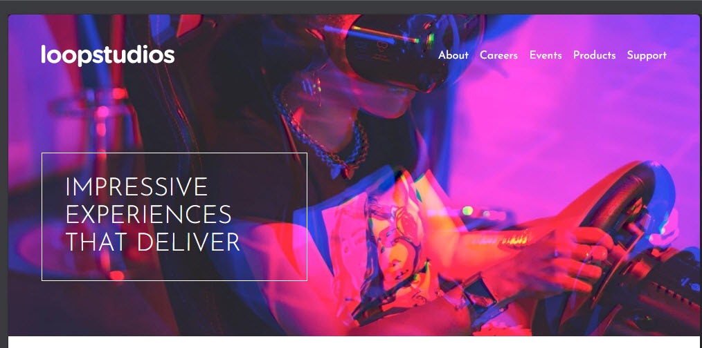
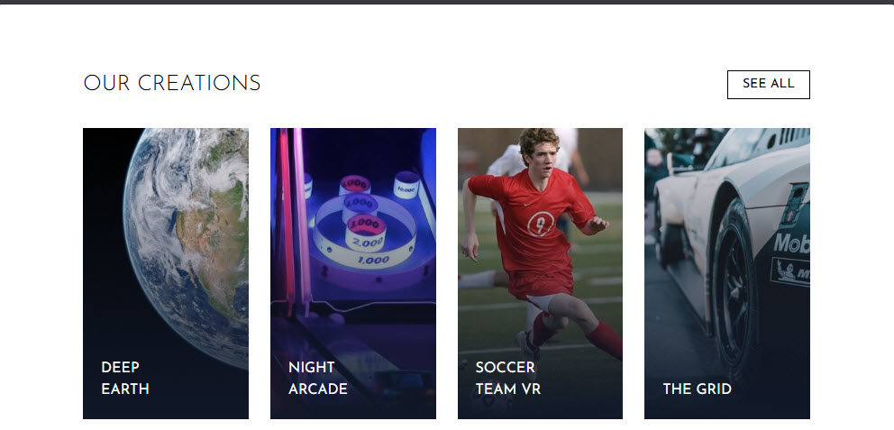

# LoopStudios-website
Project 2 for 'Tailwind From Scratch' - Packt

### Getting started

```bash
git clone https://github.com/RamirezJM/LoopStudios-website.git

cd LoopStudios-website

npm install
```

### Usage

```bash
npm run dev
```

<div>
  
</div>

<div>
  
</div>


